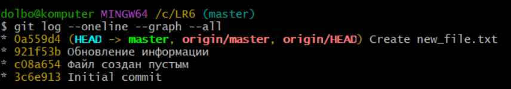
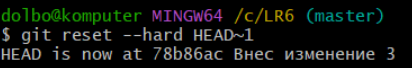

# LR6
Лабораторная работа №6

# Отчет по работе с Git

## 1. Создание форка
Сделана копия в личное хранилище из https://github.com/Kurtyanik/LR6/

## 2. Настройка клиента git
Команда для изменения имени пользователя:

```bash
$ git config --global user.name "4318 Герасимов Д.А."
```
Команда для изменения почты пользователя:

```bash
$ git config --global user.email "dolbocluv@gmail.com"
```
*Результаты изменения имени и почты пользователя*  


## 3. Клонирование репозитория

```bash
$ git clone https://github.com/dolbocluv/LR6
```
*Скриншот клонирования*  


## 4. Добавление нового файла
*Скриншот с добавлением нового файла*


## 5. Добавление изменений в локальный репозиторий

```bash
$ git pull
```
*Изменения данных в локальном репозитории*


## 6. Получение данных для каждой из веток

```bash
$ git log --oneline --graph --all
```
*Результат работы команды*




## 7. Просмотр последних изменений

```bash
$ git log
```
*Результат работы команды*


## 8. Создание новой ветки

```bash
$ git checkout -b new-feature
$ git add .  
$ git commit -m "Изменения в новой ветке"
```
Решение конфликта с помощью редактора nano путем замены содержимого new_file.txt в ветке 
*Результат добавления новой ветки*


## 9. Слияние веток

```bash
$ git checkout master
$ git merge new-feature
```
*Выполнено слияние веток*


## 10. Удаление побочной ветки после слияния

```bash
$ git branch -d new-feature
```
*Удалил побочную ветку*


## 11. Сделал несколько изменений, закоммитив их с комментариями

*Скриншот коммитов*


*Запушил коммиты*


## 12. Откат коммита
Удаление последнего коммита с помощью команды:

```bash
$ git reset --hard HEAD~1
```
*Скриншот отката*




Загрузил на GitHub локальные данные:

```bash
$ git push --force origin master
```
*Обновил данные на GitHub*


*Обновленные данные на GitHub*


## 13. Создание ветки для отчета

```bash
$ git checkout -b report
```
*Создание ветки для отчета*


## 14. Получение истории операций в форматированном виде

```bash
$ git log --pretty=format:"%h %ad %an %s" --date=short
```

## 15. История операций
Список истории операций:


78b86ac 2024-11-14 4318 Герасимов Д.А. Внес изменение 3


f002050 2024-11-14 4318 Герасимов Д.А. Внес изменение 2


02b7a9d 2024-11-14 4318 Герасимов Д.А. Внес изменение 1


0a559d4 2024-11-14 Dmitrii Create new_file.txt


921f53b 2020-11-21 Kurtyanik Обновление информации


c08a654 2020-11-21 Kurtyanik Файл создан пустым


3c6e913 2020-11-21 Kurtyanik Initial commit

## 16. Вывод
В ходе выполнения работы я повторил базовые возможности системы управления версиями, получил опыт работы с Git Api, опыт работы с локальным и удаленным репозиторием.
